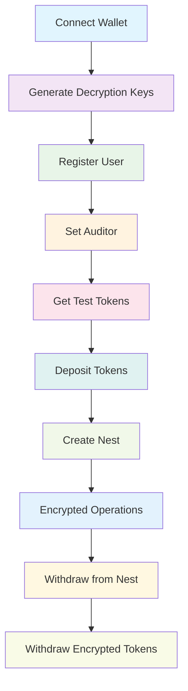
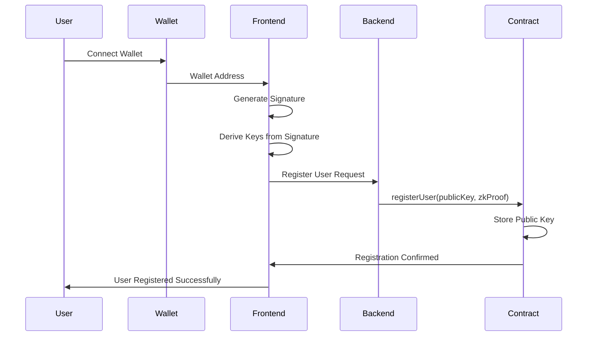
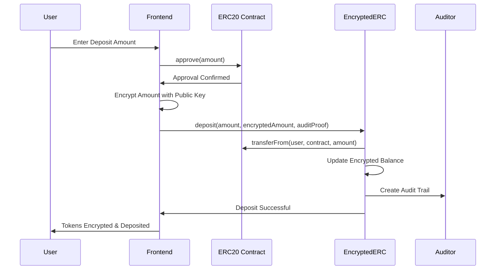
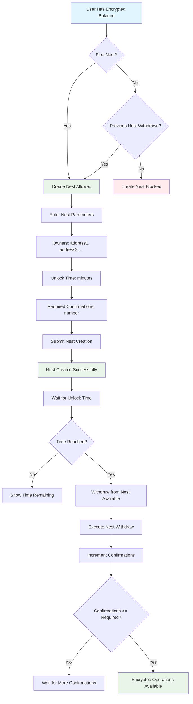
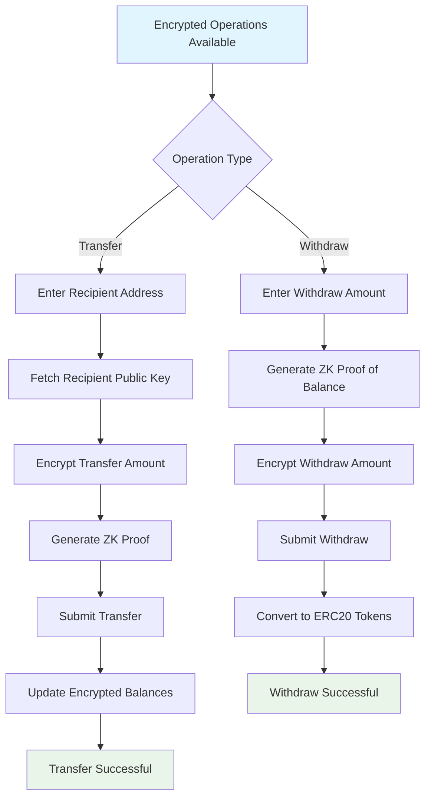
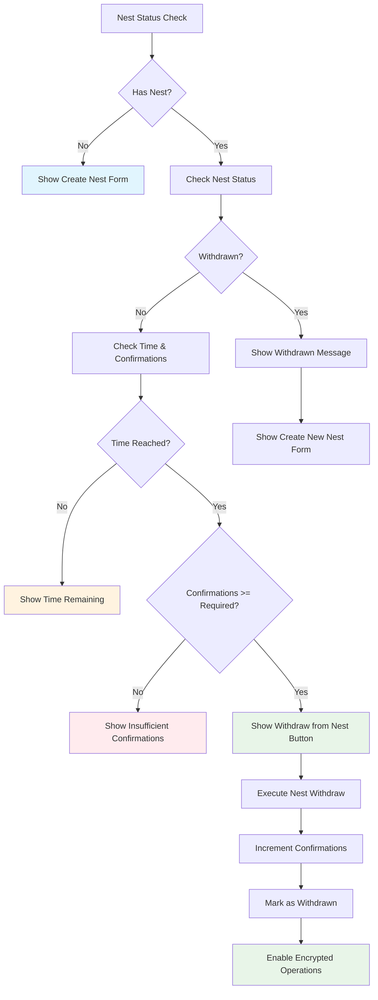

# 🔐 SecureNest

A revolutionary encrypted token system that enables private social savings through time-locked nests, where users can securely store and transfer tokens with complete privacy. Built on homomorphic encryption and zero-knowledge proofs, only users can decrypt their balances while maintaining full auditability for compliance.

## 🌟 **Value Proposition**

### **🔒 Complete Privacy**
- **Fully Private Transactions**: Amounts and recipients are hidden from public view
- **Homomorphic Encryption**: Mathematical operations on encrypted data without decryption
- **Zero-Knowledge Proofs**: Transaction validation without revealing sensitive information

### **🏦 Temporal Nest Management (TimeLockNest)**
- **Intelligent Time Locking**: Encrypted tokens locked for defined time periods
- **Multisig System**: Multiple owners with required confirmations
- **Conditional Withdrawal**: Only available when time and confirmations are met

### **⚡ Optimized Performance**
- **100x Faster**: Optimized balance calculations with intelligent caching
- **Multi-Strategy Search**: Advanced algorithms for efficient decryption
- **Centralized Management**: Unified cryptographic utilities

## 🏗️ **System Architecture**

### **📁 Project Structure**

```
Branch Master
eERC20/
├── fd-eerc/                            # React + TypeScript Frontend
│   ├── src/
│   │   ├── components/
│   │   │   ├── operations/             # Encrypted operation components
│   │   │   │   ├── Deposit.tsx         # Token deposit
│   │   │   │   ├── Withdraw.tsx        # Token withdrawal
│   │   │   │   ├── Transfer.tsx        # Private transfer
│   │   │   │   └── Operations.tsx      # Operations container
│   │   │   └── securenest/             # Temporal nest management
│   │   │       └── SecureNestMode.tsx  # TimeLockNest interface
│   │   ├── pages/
│   │   │   └── EERC.tsx                # Main page with sliding window
│   │   └── config/
│   │       └── contracts.ts            # Contract configuration
│   └── package.json
├── eerc-backend-converter/             # Hardhat + Solidity Backend
│   ├── contracts/
│   │   ├── EncryptedERC.sol            # Main encrypted token contract
│   │   ├── TimeLockNest.sol            # Temporal nest contract
│   │   ├── Registrar.sol               # User registration
│   │   └── verifiers/                  # ZK proof verifiers
│   ├── scripts/
│   │   ├── converter/                  # Converter mode scripts
│   │   └── standalone/                 # Standalone mode scripts
│   │   └── utility-contracts/README.md # Timelock Nests scripts
│   └── README.md                       # Detailed backend documentation
└── README.md                           # This file
```

## 🚀 **Operation Modes**

### **🔄 Converter Mode (ERC20 → Encrypted)**
- **Purpose**: Convert existing ERC20 tokens to encrypted format
- **Flow**: Deposit → Encryption → Private Operations → Withdrawal
- **Use Case**: Privacy layer for existing token economies

### **🏦 Standalone Mode (Native Encrypted Tokens)**
- **Purpose**: Create native encrypted "PRIV" tokens
- **Flow**: Minting → Distribution → Private Operations → Burning
- **Use Case**: Central Bank Digital Currency (CBDC), private token issuance

## 🔄 **User Interface Flow Diagrams**

### **📱 Complete User Journey**



### **🔐 Key Generation & Registration Flow**



### **💰 Token Deposit & Encryption Flow**



### **🏗️ Nest Creation & Management Flow**



### **🔐 Encrypted Operations Flow**



### **⏰ TimeLockNest Validation Flow**



## 🔐 **Core Processes**

### **1. User Registration**
```typescript
// Generate deterministic cryptographic keys
const userKeys = generateKeysFromSignature(userSignature);
const publicKey = userKeys.publicKey;
const privateKey = userKeys.privateKey;

// Register on blockchain with zero-knowledge proof
await registrar.registerUser(publicKey, zkProof);
```

### **2. Token Deposit**
```typescript
// Approve ERC20 tokens
await erc20Token.approve(encryptedERC.address, amount);

// Deposit with homomorphic encryption
await encryptedERC.deposit(amount, encryptedAmount, auditProof);
```

### **3. Private Transfers**
```typescript
// Generate zero-knowledge proof
const transferProof = generateZKProof({
    senderBalance: encryptedSenderBalance,
    transferAmount: encryptedAmount,
    recipientPublicKey: recipientKey
});

// Transfer without revealing amounts
await encryptedERC.transfer(recipient, encryptedAmount, transferProof);
```

### **4. Temporal Nest Management**

#### **Nest Creation**
```typescript
// Nest parameters
const owners = ["0x1234...", "0x5678..."];  // Owners
const unlockTime = Math.floor(Date.now() / 1000) + (60 * 60); // 1 hour
const required = 2;  // Required confirmations
const confirmations = 0;  // Initial confirmations

// Create nest
await timeLockNest._storeNest(owners, unlockTime, required, confirmations);
```

#### **Nest Withdrawal**
```typescript
// Verify conditions
const canWithdraw = currentTime >= unlockTime && !withdrawn;

// Withdraw that increments confirmations
await timeLockNest.withdraw(nestId);
```

### **5. Encrypted Token Withdrawal**
```typescript
// Verify nest conditions
const canWithdrawEncrypted = 
    currentTime >= unlockTime && 
    confirmations >= required;

// Withdraw with zero-knowledge proof
const withdrawProof = generateZKProof({
    encryptedBalance: userEncryptedBalance,
    withdrawAmount: encryptedAmount
});

await encryptedERC.withdraw(amount, withdrawProof);
```

## 🎯 **Advanced Technical Features**

### **🔐 Cryptography**
- **Homomorphic Encryption**: Operations on encrypted data
- **BabyJubJub Elliptic Curves**: Optimized elliptic curve cryptography
- **Zero-Knowledge Proofs**: Validation without revealing information
- **Deterministic Keys**: Key derivation from user signatures

### **⚡ Performance Optimizations**
- **Intelligent Caching**: Pre-populated cache with FIFO eviction
- **Multi-Strategy Search**: 
  - Small values (0-1000)
  - Round numbers
  - Chunked search
  - Linear fallback
- **100x Faster Calculations**: Optimized discrete logarithm algorithms

### **🏗️ Contract Architecture**
- **EncryptedERC**: Main contract for encrypted operations
- **TimeLockNest**: Temporal nest management with multisig
- **Registrar**: User registration and management
- **Verifiers**: Zero-knowledge proof validation

## 🎨 **User Interface**

### **🖥️ React Frontend**
- **Sliding Window**: Fluid navigation between sections
- **Modular Components**: Separate and reusable operations
- **Attractive Styles**: Modern gradients and animations
- **Responsive Design**: Adaptable to different screen sizes

### **📱 Main Sections**
1. **How it Works**: System explanation
2. **System Setup & Smart Contracts**: Configuration and status
3. **Nest Management**: Temporal nest management
4. **Encrypted Operations**: Encrypted token operations

### **🔧 Operation Components**
- **Deposit**: Token deposit with encryption
- **Withdraw**: Conditional withdrawal based on nests
- **Transfer**: Private transfers
- **Nest Creation**: Temporal nest creation

## 🛠️ **Installation and Setup**

### **Prerequisites**
```bash
# Node.js and npm
node --version  # v18+
npm --version   # v8+

# Private keys for testing
export PRIVATE_KEY=your_first_private_key
export PRIVATE_KEY2=your_second_private_key

# AVAX testnet tokens for gas
```

### **Environment Configuration**
```bash
# Create .env file
RPC_URL=https://api.avax-test.network/ext/bc/C/rpc
PRIVATE_KEY=your_first_private_key_here
PRIVATE_KEY2=your_second_private_key_here
FORKING=false
```

### **Installation**
```bash
# Backend
cd eerc-backend-converter
npm install

# Frontend
cd ../fd-eerc
npm install
```

## 🚀 **Quick Start Guide**

### **1. Backend Deployment**
```bash
cd eerc-backend-converter

# Deploy basic components
npx hardhat run scripts/converter/01_deploy-basics.ts --network fuji

# Deploy converter system
npx hardhat run scripts/converter/02_deploy-converter.ts --network fuji

# Register users (edit scripts manually)
npx hardhat run scripts/converter/03_register-user.ts --network fuji  # walletNumber = 1
npx hardhat run scripts/converter/03_register-user.ts --network fuji  # walletNumber = 2

# Configure auditor
npx hardhat run scripts/converter/04_set-auditor.ts --network fuji    # walletNumber = 1
```

### **2. Frontend Configuration**
```bash
cd ../fd-eerc

# Update config/contracts.ts with deployed addresses
# Run application
npm run dev
```

### **3. Basic Operations**
```bash
# Get test tokens
npx hardhat run scripts/converter/05_get_faucet.ts --network fuji

# Make deposits
npx hardhat run scripts/converter/06_deposit.ts --network fuji

# Check balances
npx hardhat run scripts/converter/08_check_balance.ts --network fuji

# Private transfers
npx hardhat run scripts/converter/07_transfer.ts --network fuji

# Withdrawals
npx hardhat run scripts/converter/09_withdraw.ts --network fuji
```

## 🗺️ **Roadmap and Future Improvements**

### **🎯 Phase 1: Current Optimization (Completed)**
- ✅ Intelligent caching system
- ✅ 100x faster calculations
- ✅ Centralized utility management
- ✅ Improved user interface
- ✅ TimeLockNest integration

### **🚀 Phase 2: Feature Expansion (In Development)**
- 🔄 **Complete Web Interface**: Advanced management dashboard
- 🔄 **Multiple Tokens**: Support for multiple ERC20s simultaneously
- 🔄 **REST API**: Endpoints for external application integration
- 🔄 **Notifications**: Real-time alert system

### **🌟 Phase 3: Advanced Features (Planned)**
- 📋 **Governance**: Encrypted voting system
- 📋 **Encrypted Staking**: Private rewards for participation
- 📋 **Cross-Chain**: Interoperability between different blockchains
- 📋 **Mobile App**: Native mobile application

## 🔧 **Troubleshooting**

### **Common Issues**

#### **🔄 Converter Mode**
1. **"User not registered"** → Run registration script
2. **"Auditor not set"** → Configure auditor with corresponding script
3. **"Insufficient balance"** → Get tokens from faucet
4. **"Keys don't match"** → Re-run registration with same wallet

#### **🏦 TimeLockNest**
1. **"Nest not ready"** → Verify time and confirmations
2. **"Insufficient confirmations"** → Wait for more confirmations
3. **"Already withdrawn"** → Nest has already been withdrawn

#### **⚡ Performance**
1. **Slow calculations** → Verify use of optimized scripts
2. **Insufficient memory** → Cache limited to 1000 entries
3. **Large balance** → Increase search range if necessary

## 📚 **Additional Documentation**

### **📖 Detailed Guides**
- [Backend Documentation](eerc-backend-converter/README.md) - Complete backend documentation
- [Converter Mode Guide](eerc-backend-converter/scripts/converter/README.md) - Converter mode guide
- [Standalone Mode Guide](eerc-backend-converter/scripts/standalone/README.md) - Standalone mode guide

### **🔗 Useful Links**
- [Avalanche Fuji Testnet](https://docs.avax.network/build/tutorials/smart-contracts/deploy-a-smart-contract-on-avalanche-using-remix-and-metamask)
- [Hardhat Documentation](https://hardhat.org/docs)
- [React Documentation](https://reactjs.org/docs)

## 🤝 **Contributing**

### **How to Contribute**
1. Fork the repository
2. Create feature branch (`git checkout -b feature/new-feature`)
3. Commit changes (`git commit -am 'Add new feature'`)
4. Push to branch (`git push origin feature/new-feature`)
5. Create Pull Request

### **Code Standards**
- **TypeScript**: Strict typing for frontend
- **Solidity**: Security standards for contracts
- **Documentation**: Clear comments and updated READMEs
- **Testing**: Unit and integration tests

## 📄 **License**

This project is under the MIT License. See the [LICENSE](LICENSE) file for more details.

## 👥 **Team**

- **Backend Development**: Smart contracts and deployment scripts
- **Frontend Development**: React user interface
- **Cryptography**: Homomorphic encryption and ZK proofs implementation
- **UX/UI**: Interface design and user experience

## 📞 **Contact**

For questions, suggestions, or collaborations:
- **Issues**: Use GitHub issues system
- **Discussions**: Participate in repository discussions
- **Email**: [Project contact]

---

**🔐 EncryptedERC - Privacy, Security and Efficiency in Digital Tokens**
